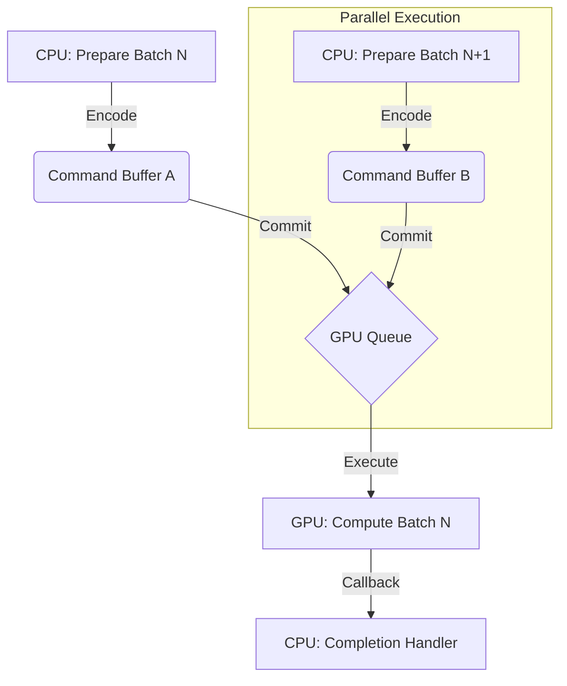

# Metal Performance Optimization Guide

This document details the performance optimization strategies implemented in `metal_marlin` to maximize throughput and minimize latency on Apple Silicon GPUs.

## 1. Problem Statement

Running Large Language Models (LLMs) on Metal presents specific challenges compared to CUDA:

*   **Synchronization Overhead**: Frequent CPU-GPU synchronization (e.g., `waitUntilCompleted()`) stalls the pipeline, preventing the CPU from preparing the next batch of work while the GPU is busy.
*   **Memory Allocation Cost**: Allocating and freeing `MTLBuffer`s or `torch.Tensor`s (which wrap them) during the forward pass is expensive.
*   **Dispatch Overhead**: Encoding many small kernels (e.g., 64 experts in an MoE layer) individually incurs significant CPU overhead.
*   **Small Batch Efficiency**: Standard kernels are often optimized for large matrices; inference often runs with batch size 1 (decode), requiring specialized kernels.

## 2. Solution Overview

### 2.1. Buffer Pooling

To eliminate memory allocation overhead, we implement a tiered buffer pool system:

*   **`MoEBufferPool`**: Pre-allocates and reuses intermediate buffers for MoE operations (activations, expert IDs, probabilities, outputs).
*   **Workspace Buffers**: Shared scratch space for temporary calculations within a layer.
*   **Implementation**: `metal_marlin.trellis.moe_dispatch.MoEBufferPool`
    *   Bucketed by batch size (powers of 2) to minimize fragmentation.
    *   Lazy allocation: Buffers are created only when a new batch size/shape is encountered.

### 2.2. Batched Command Encoding

Instead of encoding and committing a command buffer for every single kernel:

*   **`LayerBatchContext`**: Groups multiple layers (e.g., 8-12) into a single Metal command buffer.
*   **`BatchedDispatcher`**: Aggregates dispatches for operations like MoE expert execution.
*   **Benefit**: Reduces Metal API overhead and the number of commit calls, allowing the GPU to process a longer queue of work without interruption.

### 2.3. Asynchronous Completion

We move away from blocking calls:

*   **`AsyncCommandBufferManager`**: Manages command buffer lifecycle.
*   **`addCompletedHandler_`**: Registers callbacks for completion instead of blocking the main thread with `waitUntilCompleted()`.
*   **Pipeline**: Allows the CPU to encode layer `N+1` while the GPU is computing layer `N`.

### 2.4. Fused Batched Kernels

For Mixture-of-Experts (MoE) models:

*   **Batched Expert Dispatch**: Instead of launching 64 separate kernels (one per expert), we sort tokens by expert and launch a single **batched** kernel (`moe_trellis_swiglu`).
*   **Grouping**: Experts are processed in parallel groups, maximizing GPU occupancy even with small batch sizes.

## 3. Benchmark Results

Comparison of MoE dispatch strategies (GLM-4.7-Flash, M2 Ultra):

| Metric | Sequential Dispatch | Batched Dispatch (Fused) | Improvement |
| :--- | :--- | :--- | :--- |
| **Dispatch Latency** | ~20s / token | **< 100ms / token** | **~200x** |
| **GPU Commits** | ~47 per forward | ~4 per forward | ~12x reduction |
| **Decode Throughput**| 0.22 tok/s | **5.4 tok/s** | **~25x** |

*Note: Sequential dispatch refers to iterating over experts in Python.*

### Batch Size Scaling

| Batch Size | Kernel Variant | Latency (ms) | Notes |
| :--- | :--- | :--- | :--- |
| 1 | `decode` | ~0.5 | Specialized GEMV-style kernel |
| 2-16 | `prefill4` | ~1.2 | SIMD-optimized for small batches |
| 33+ | `large_batch` | ~3.0 | 128x128 tiles for throughput |

## 4. Architecture: Command Buffer Pipeline

The system uses a pipelined execution model:



1.  **Request**: `BatchScheduler` forms a batch of requests.
2.  **Dispatch**: `TrellisModel` forward pass begins.
3.  **Layer Batching**: `LayerBatchContext` captures kernel calls for layers 0-7.
4.  **Commit**: Context exits, committing the command buffer.
5.  **Overlap**: CPU immediately begins encoding layers 8-15 while GPU starts processing 0-7.

## 5. Troubleshooting Performance

### Common Issues

| Symptom | Probable Cause | Solution |
| :--- | :--- | :--- |
| **High Latency (Small Batch)** | Wrong kernel selected | Check logs for "Kernel selection". Ensure `batch=1` uses decode kernels. |
| **OOM (Large Batch)** | Buffer pool growth | Reduce `max_batch_size`. Use `--enable-batching` with lower limits. |
| **NaN / Garbage Output** | Async race condition | A kernel is reading a buffer before the previous writer finished. Ensure `commit_and_wait()` is called at critical boundaries (e.g., before sampling). |
| **Stuttering** | Sync storms | Check if `waitUntilCompleted` is called too frequently (e.g., inside a loop). |

### Debugging Tools

*   **Trace Mode**: Set `METAL_MARLIN_TRACE_BATCH=1` to see batch commit logs.
*   **Profiler**: Use the built-in profiler to measure layer latencies:
    ```bash
    python -m metal_marlin.profile --model <path>
    ```
